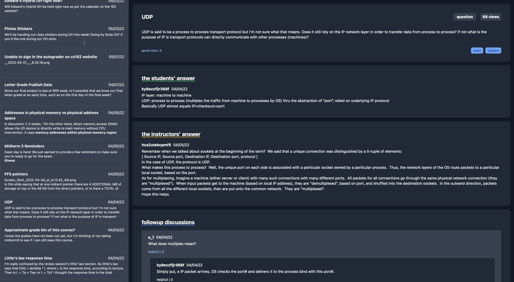

# Piazzabox

Piazza course archiver and statically hostable viewer

- viewer: renders archived piazza courses. built with alpine.js + tailwind.
- archive: archive courses to json (forked from 64bitpandas)

### usage

1. use `python3 archive.py` to archive a Piazza course.
2. move the resulting `posts.json` into the `viewer/src` directory.
3. run `python3 -m http.server` in the `viewer/src` directory (alternatively,
host this directory somewhere).
4. go to `localhost:8000` in your favorite web browser.

### development

run `pnpm run build` after making viewer changes to rebuild tailwind css and format.

### todo

- support multiple posts.json
- source images
- search posts
- usernames
- profile pictures
