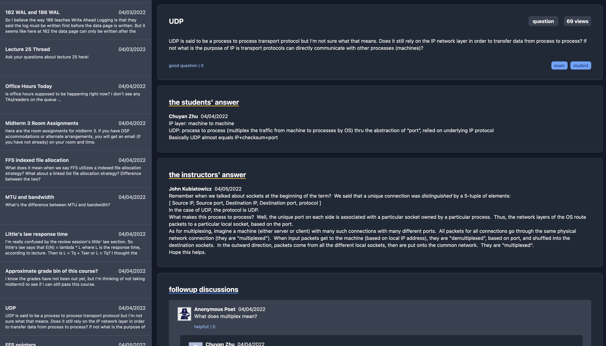

# Piazzabox

Piazzabox is an archiver for Piazza courses. Piazzabox saves posts and linked
assets from Piazza and generates a static site for local viewing.

Built with Python and Alpine.js + Tailwind.



### Features

- Archives course info and posts to json files
- Downloads file attachments and user profile photos
- Generates an offline, searchable webpage for each archived course
- Webpages properly display markdown and math notations (LaTeX)
- Anonymous usernames are correctly generated (matches what's shown on Piazza)

### Installation

```sh
python3 -m venv venv
source ./venv/bin/activate
pip install -r requirements.txt
```

### Usage

1. Run `python3 piazzabox.py` and enter your login credentials.
2. Choose Piazza courses to archive.
3. Open the generated `index.html` file found in the `out` folder
   (alternatively, host this somewhere).

Optional: Rename the `secrets.template.json` file to `secrets.json` and fill
in your Piazza email and password to keep your login credentials saved.

If Piazzabox fails due to network errors or is otherwise interrupted while
archiving, restart the program and it will pick up where it left off.

### Development

There is no need to install dev dependencies for the webpage unless you are
making changes to it. Use the following to install dev dependencies:

```sh
cd viewer
pnpm install
# Important: Run after making changes to re-build tailwind css
# pnpm run build
```
